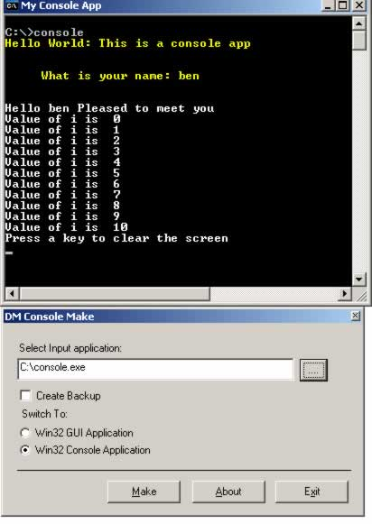



## DM Console\+Make Tool

### Description

Hi all, this is a real console app that can run from the DOS Prompt. comes with it's own tools so you can convert the app after it's been compiled. so no need to mess around with Link.exe. well it comes with it's own example. and also I made a little help file.

Hope you like it.
 
### More Info
 

             |
---                |---
**Submitted On**   |2005-04-28 05:45:34
**By**             |[dreamvb](https://github.com/Planet-Source-Code/PSCIndex/blob/master/ByAuthor/dreamvb.md)
**Level**          |Beginner
**User Rating**    |5.0 (25 globes from 5 users)
**Compatibility**  |VB 6\.0
**Category**       |[Files/ File Controls/ Input/ Output](https://github.com/Planet-Source-Code/PSCIndex/blob/master/ByCategory/files-file-controls-input-output__1-3.md)
**World**          |[Visual Basic](https://github.com/Planet-Source-Code/PSCIndex/blob/master/ByWorld/visual-basic.md)
**Archive File**   |[DM\_Console1881934282005\.zip](https://github.com/Planet-Source-Code/dreamvb-dm-console-make-tool__1-60248/archive/master.zip)

